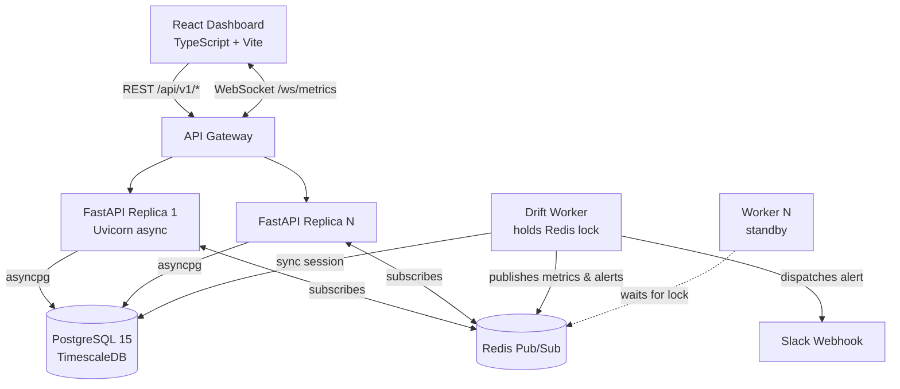

# Forecast Calibration Monitor

[](https://github.com/swayamjaiswal152/calibration-monitor/actions/workflows/ci.yml)


A real-time platform that watches whether a forecasting model's **prediction intervals still mean what they claim**. It ingests hourly point forecasts with 90% intervals, joins them against ground truth as it arrives, computes rolling coverage metrics over a 168-hour window, and **auto-corrects interval width on drift** using Adaptive Conformal Prediction — pushing live updates to a dashboard and firing Slack alerts with sub-30s detection delay.

> A forecast that says "90% interval" should contain the truth 90% of the time. When reality drifts, that promise silently breaks. This system makes the break visible, measurable, and self-correcting.

---

## Features

- **Rolling calibration metrics** — PICP (coverage), MPIW (interval width), and MAE computed natively in PostgreSQL over a 168h rolling window, not Pandas.
- **Adaptive Conformal Prediction** (Gibbs & Candès, 2021) — online quantile correction `q_{t+1} = q_t + η·(err − α)` that widens intervals when coverage slips and shrinks them back when it recovers.
- **Real-time push** — Redis Pub/Sub → WebSocket fan-out, so any API replica delivers updates generated by the background worker.
- **Drift alerts** — Slack Block Kit notifications when coverage falls below the 90% target (<30s detection delay).
- **What-If simulator** — slider-driven drift injection with instant coverage preview before committing to the DB.
- **Prometheus `/metrics`** — per-sensor gauges (`calibration_picp`, `calibration_mae`, `calibration_mpiw`, `calibration_conformal_q`, `calibration_window_samples`) for Grafana/alertmanager.
- **Horizontally scalable** — stateless FastAPI replicas + a separately-scaled worker guarded by a distributed Redis lock (no duplicate schedulers).

---

## Architecture



**Flow:** forecasts and actuals are ingested via REST and committed directly (no work on the hot path). A single worker — elected via a `drift_job_lock` in Redis — recomputes rolling metrics every 15s in SQL, publishes results to the `metrics_channel`, and persists alerts on drift. Every API replica subscribes to that channel and pushes to its locally-connected WebSocket clients, solving cross-replica delivery. See [`Architecture.md`](./Architecture.md) for the full breakdown.

---

## Quickstart

**Prerequisites:** Docker + Docker Compose.

```bash
git clone https://github.com/swayamjaiswal152/calibration-monitor.git
cd calibration-monitor
cp .env.example .env          # optional: add your SLACK_WEBHOOK_URL
docker compose up --build
```

| Service | URL |
|---|---|
| Dashboard (React) | http://localhost:5173 |
| API (FastAPI) | http://localhost:8000 |
| API docs (Swagger) | http://localhost:8000/docs |
| Prometheus metrics | http://localhost:8000/metrics |
| Health check | http://localhost:8000/health |

Postgres (TimescaleDB) runs on `5432` and Redis on `6379`. Schema is created idempotently on API startup — no manual migration step.

### Try it

```bash
# Inject synthetic drift for a sensor and watch the dashboard react
curl -X POST "http://localhost:8000/api/v1/simulate/drift?sensor_id=sensor-1&drift=5&n=50"

# Preview the coverage impact of a drift without writing to the DB
curl -X POST "http://localhost:8000/api/v1/simulate/whatif?drift=5"
```

---

## Deploy to Render

[](https://render.com/deploy?repo=https://github.com/swayamjaiswal152/calibration-monitor)

The repo ships a [`render.yaml`](./render.yaml) Blueprint that provisions the whole stack:

| Service | Type | Plan |
|---|---|---|
| `calib-db` | PostgreSQL | free |
| `calib-redis` | Key Value (Redis) | free |
| `calib-api` | Docker web service (API **+ in-process drift worker**) | free |
| `calib-frontend` | Static site (Vite build) | free |

**Steps:** Render Dashboard → **New → Blueprint** → connect this repo. Render reads `render.yaml`, wires `DATABASE_URL`/`REDIS_URL`/`VITE_API_URL` between services automatically, and deploys. Optionally set `SLACK_WEBHOOK_URL` on the `calib-api` service to enable Slack alerts.

> **Free-tier note:** Render's free plan has no Background Workers, so the drift loop runs as an in-process daemon thread inside the API (`RUN_WORKER_IN_PROCESS=true`). To restore the fully decoupled architecture, add a `type: worker` service running `python -m app.worker` (requires a paid instance). Free services also sleep after inactivity, so the first request after idle incurs a cold start.

---

## API Reference

Base path: `/api/v1`

| Method | Endpoint | Description |
|---|---|---|
| `POST` | `/forecasts` | Record an hourly forecast (`y_pred`, `y_lower`, `y_upper`) |
| `POST` | `/actuals` | Ingest ground truth for a forecast |
| `GET` | `/metrics?sensor_id=x&window=168` | Rolling PICP, PICP-corrected, MAE, MPIW, q-value |
| `GET` | `/alerts` | Last 50 drift alerts |
| `GET` | `/conformal/state?sensor_id=x` | Current q-value and interval-width delta |
| `POST` | `/conformal/reset?sensor_id=x` | Reset conformal correction to q=0 |
| `POST` | `/simulate/drift?sensor_id=x&drift=5&n=50` | Inject synthetic drift (writes to DB) |
| `POST` | `/simulate/whatif?drift=5` | Preview coverage impact (no DB write) |

**Non-prefixed endpoints**

| Method | Endpoint | Description |
|---|---|---|
| `WS` | `/ws/metrics` | Live push of `metrics_update` and `alert` events |
| `GET` | `/metrics` | Prometheus exposition (per-sensor gauges) |
| `GET` | `/health` | Liveness probe |

---

## How calibration is measured

| Metric | Meaning | Healthy |
|---|---|---|
| **PICP** | Prediction Interval Coverage Probability — fraction of actuals that landed inside `[y_lower, y_upper]` | ≈ 0.90 |
| **MPIW** | Mean Prediction Interval Width — average `y_upper − y_lower` | as narrow as possible while holding coverage |
| **MAE** | Mean Absolute Error of the point forecast | lower is better |

**Drift rule:** `is_drift(picp) = picp < TARGET − EPSILON` with `TARGET = 0.90`, `EPSILON = 0.05` (i.e. coverage below 85% fires an alert).

**Adaptive Conformal Prediction:** on each observation the correction term updates as `q_{t+1} = q_t + η·(err − α)` with `η = 0.05`, `α = 0.1`, and `err = 1` if the actual was miscovered else `0`. The corrected interval is `[y_lower − q, y_upper + q]`, so persistent miscoverage pushes `q` up (wider intervals) until coverage is restored, then `q` relaxes back down.

---

## Testing & load

```bash
# Unit tests (worker drift logic, metrics, Prometheus endpoint)
cd backend && pip install -r requirements.txt && pytest tests -v

# Load test — p95 < 140ms at ~600 RPS
locust -f locustfile.py --host http://localhost:8000
```

CI (GitHub Actions) runs `pytest` and `docker compose build` on every push and pull request.

---

## Project structure

```
backend/
  app/
    main.py              # FastAPI app, lifespan migrations, router wiring
    database.py          # async (API) + sync (worker) engines
    models.py            # forecasts, actuals, alerts, conformal_state
    conformal.py         # Adaptive Conformal Prediction logic
    worker.py            # distributed drift worker (Redis-locked, 15s loop)
    slack.py             # Slack Block Kit alert dispatch
    websocket_manager.py # Redis Pub/Sub ↔ WebSocket bridge
    routers/             # forecasts, actuals, metrics, simulate, conformal, prometheus
  tests/                 # pytest suite
frontend/
  src/                   # React + Vite dashboard (Recharts), What-If & Conformal panels
docker-compose.yml       # db + redis + api + worker + frontend
locustfile.py            # load profile
```

---

## Configuration

Set via environment (see [`.env.example`](./.env.example)):

| Variable | Default | Purpose |
|---|---|---|
| `DATABASE_URL` | `postgresql://postgres:postgres@db:5432/calibration` | Postgres connection |
| `REDIS_URL` | `redis://redis:6379/0` | Redis Pub/Sub + lock |
| `TARGET_COVERAGE` | `0.9` | Nominal interval coverage |
| `CONFORMAL_LEARNING_RATE` | `0.05` | Conformal step size `η` |
| `SLACK_WEBHOOK_URL` | _(unset)_ | Slack incoming webhook; alerts are skipped if blank |

---

## Roadmap

See [`Phases.md`](./Phases.md). Remaining polish: deploy to Render/Fly.io, add a demo GIF.

---

## License

MIT
